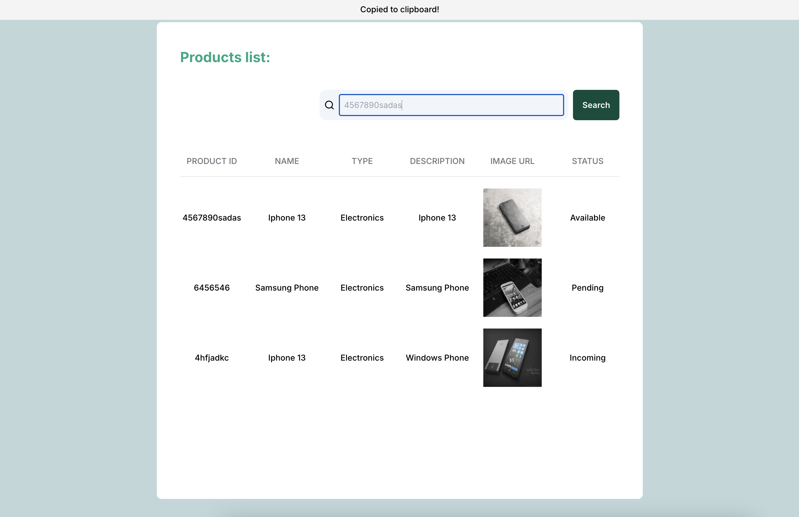
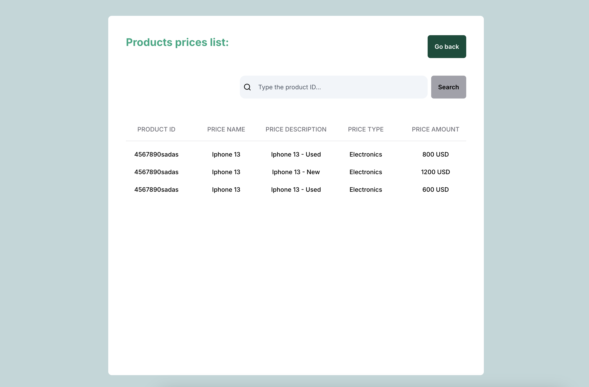

# NextJS 14 Product Prices Filter App

## Introduction
This repository was made for learning purposes on how to create a product prices filtering application with NextJs 14 new App Router's API and following good practices, such as: separation of concerns, reusable components type safety, performance optimization (server side rendering, memoization, nextJS Image component), a11y, optional chaining, unit testing, good UI/UX.

In the main page we can see a list of products with their properties and a search section to search for the prices of a given product. Whenever the button is clicked, the user is redirected to the prices list of the product.
It has custom loading and error pages for better guiding the user.
The database consists in a JSON file with the products and prices, located in the root of the project.
The API fetches and converts the data from the DB into ready-to-use product and prices data for the frontend.

## How to run

Run the following commands in the frontend folder:
    `npm install`
    `npm run dev`

When everything is set up, access the frontend at `http://localhost:3000`.

## Technologies

    NextJS 14
    Typescript
    Tailwind CSS